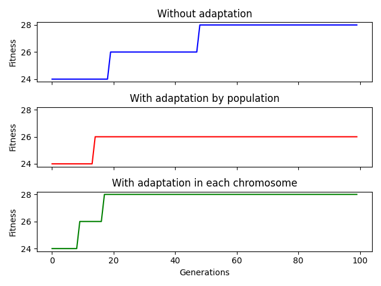

# 8 Queens Problem

This folder have an evolutionary and backtracking algorithm to solve the 8 Queens Problem

Also, I implemented another two ones with variable mutation and crossover rates by population and for each chromossome. Here is a graph to show the efficiency of them:

  
