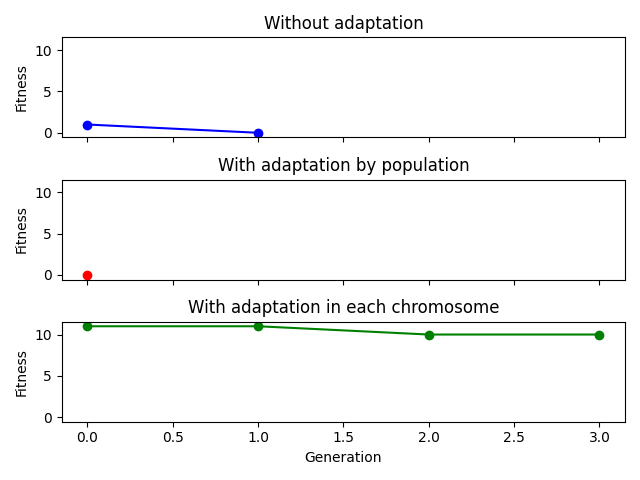

# Find expression problem

This folder have an evolutionary algorithm to find a expression to represent the target

Also, I implemented another two ones with variable mutation and crossover rates by population and for each chromossome. Here is a graph to show the efficiency of them:

  
