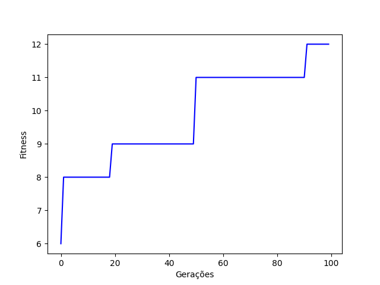

# Find Best DNA Configuration

This folder have an evolutionary algorithm to find the best DNA configuration to solve a problem. 

The problem is to find the best expression to fit a set of points, the DNAs are in string format, and we want to find the best configuration of a given set of genes. The more equal (based at the position) the DNA is to the others, the better it is.

  
